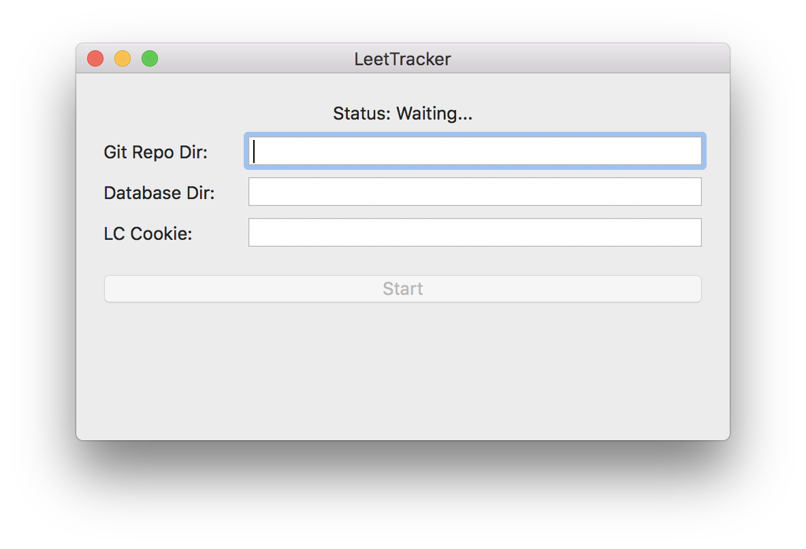

# LeetTracker

LeetTracker automatically fetches all of your LeetCode submissions to your GitHub repository. It is written purily in Swift and runs on macOS.

## Features
- Submissions are organized into individual problems
- README for each problem that includes problem description and submission details
- LeetTracker remembers which submissions have been cached and will not fetch them again

## To-do
- Add direct login
- Finish implementing completion handlers so Start button can be resetted when process completes
- Replace hacky booleans with DispatchQueue
- Generate initial database file
- Automatic commit with detailed logging messages for each scan and commit
- Error handling and retries in case of network failure
